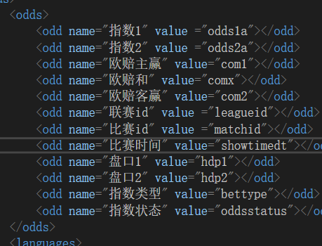
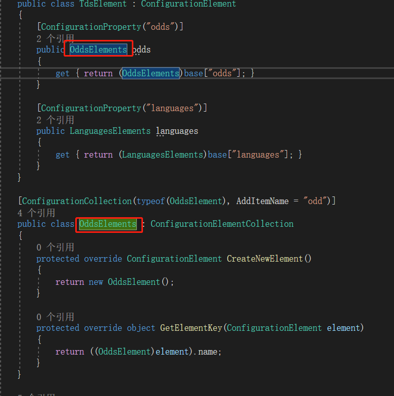
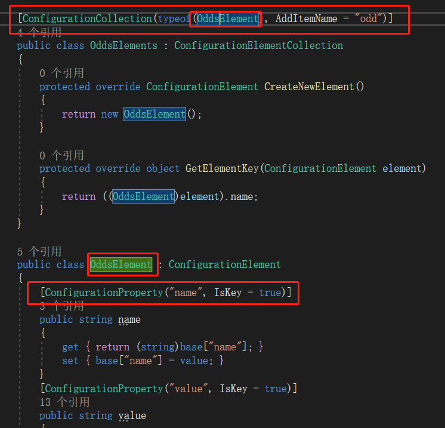
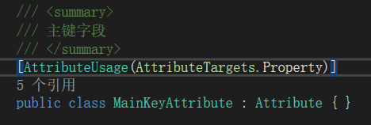
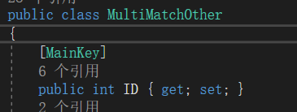
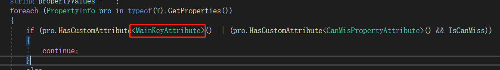
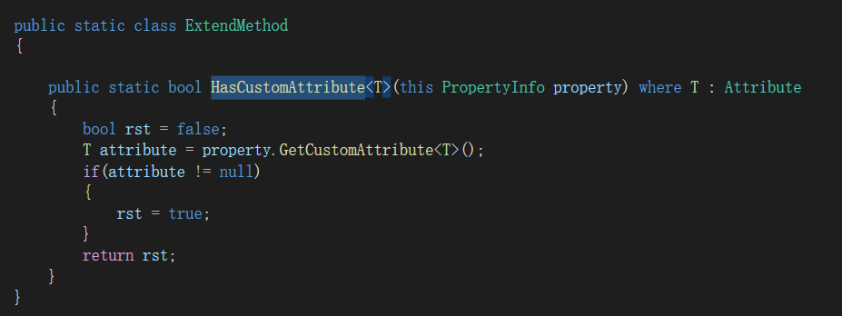

### 特性与反射使用方法

------

+ #### 特性的介绍

​        特性，是能够通过编译器编译的，写给程序看的特别的注释，提醒程序遇到带有特性标注的属性或者方法时，做特别的处理和判断。

+ #### 反射的介绍

​        反射又与泛型相关，根据传入的泛型类型，获得泛型类型的名称与属性字段，如果属性字段有特别的特性，可以对特性做另外的判断。

+ #### 特性的分类

  + ##### 系统特性

    ​        C#语言库里自带了一些特性，可以直接使用，有一定的功能。例如在写配置解析类的时候，属性的头部可以加上ConfigurationProperty("{name}")表明属性在配置文件中对应的标签名。配置类头部加上ConfigurationCollection(typeof( class ) , AddItemName = " {name} ")，表明解析类在配置文件中属于一个包含n个class子元素的集合类，子元素标签名为name。

    

    

    

  + ##### 自定义特性

    ​        自定义特性需要自行写一个继承Attribute的类并在头部标注AttributeUsage(xxx)，如图AttributeUsage(AttributeTargets.Property)表示自定义特性可以用于属性字段的头部。

    

    

    ​        写好自定义特性，并在准确的地方标好，例如特性标注在属性上方，在获取一个类的所有属性的时候，就可以检查某个属性是否有指定的特性，然后做出特殊的处理。

    

  + ##### 扩展方法

    ​        上图HasCustomAttribute<T>()方法属于自定义的扩展方法，作用是输入类型T，判断属性是否含有该特性。

    

