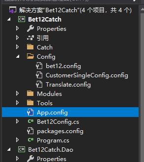

### 配置使用方法

------

- #### 配置介绍

​		程序使用配置的目的是为了日后方便维护修改，将一些固定的字符信息，例如ip信息，模式切换信号，写到配置文件中，以免当程序需要做出调整，修改细节时，再深入到项目代码中，寻找细节代码位置，回顾细节代码作用逻辑，有些地方修改了还需要其他地方同步修改，非常麻烦。使用配置文件就可以避免上述出现的问题，当程序需要做出调整，只需要打开配置文件，修改参数，然后让程序识别，成本极低，效率极高。

+ ### 配置的分类

  ​        程序所用到的配置有两种，一种为系统配置AppSetting以及自定义配置ConfigSection，其中，AppSetting一般用来存放ip地址相关的，ConfigSection用来存放与抓取网有关的抓取解析或抓取配置参数。

  + AppSetting

    + 配置位置

      ​        想要使用AppSetting前，先找到项目根目录下自带的App.config文件，并打开，如图

      

    + 设置方法

      ​        打开文件后，找到appSetting标签，增加子标签，标签名为add，需要输入元素key和value

      

    + 使用方法

      ​        在程序中使用系统配置，需要用到单例ConfigurationManager并调用属性AppSetting的Get方法，输入key，可以取得对应的value

      

  + ConfigSection

    + 配置位置

      ​        ConfigSection位置可以自定义，放在任何文件夹，文件名称和路径需要在App.config文件中的configSections标签中设置，并设置相应的解析类。

      ​        其中，configSections标签必须要位于configuration标签中的第一个位置，子标签为section，name为section名称，type为解析类所在的位置，需要从命名空间定位到cs文件的名称。

      ​        定义完section标签后，需要在configSections同级的位置写上以section名称为标签名的标签，输入属性configScource，并输入配置文件的路径

      

      

    + 设置方法

      ​        打开section对应的config文件，开头需要写上xml标签，根目录标签名称为section名称，下一个节点为一个节点（只能是一个），为解析类中的根节点，之后的标签可以自由定义。

      

    + 使用方法

      ​        使用configSectiong之前，需要正确写好相应的配置解析类，过程中会用到特性相关的知识。先打开配置类cs文件，配置类需要继承ConfigurationSection类

      ​        其中，tds为配置类的根节点，属性需要标上ConfigurationProperty特性，并打上根节点名称，根节点为一个类，需要继承ConfigurationElement类。

      

      ​        根节点元素之后，都是元素元素之间的套用，Element有两种形式，一种是Element，一种是ElementCollection，Element在它的根节点中只能存在它自己一个，ElementCollection可以存在多个相同的标签的Element和ElementCollection

      1. ElementCollection

         ​        如上面提到的configSection文件所示，odds标签有多个odd标签，因此odds标签可以定义为ElementCollcetion，定义类时需要继承ConfigurationElementCollection类。

         ​        其中，定义的类上方需要写上特性，ConfigurationCollection，里面包括子元素Element类（同样需要继承ConfigurationElement类），AddItemName为配置文件里的标签名称。

         ​        需要重写的CreateNewElement方法中，需要返回一个新的子Element类，就如odds标签里的odd标签所对应的解析类。

         

      2. Element

         odds的子标签odd标签对应的解析类应为ConfigurationElement，里面就可以设置对应的属性字段名称，属性头部需要标上特性ConfigurationProperty，同时标明属性名称，IsKey代表是否为标签内的属性，如<odd name = "???">中的name，IsKey=true。

         

    + 

  + 

